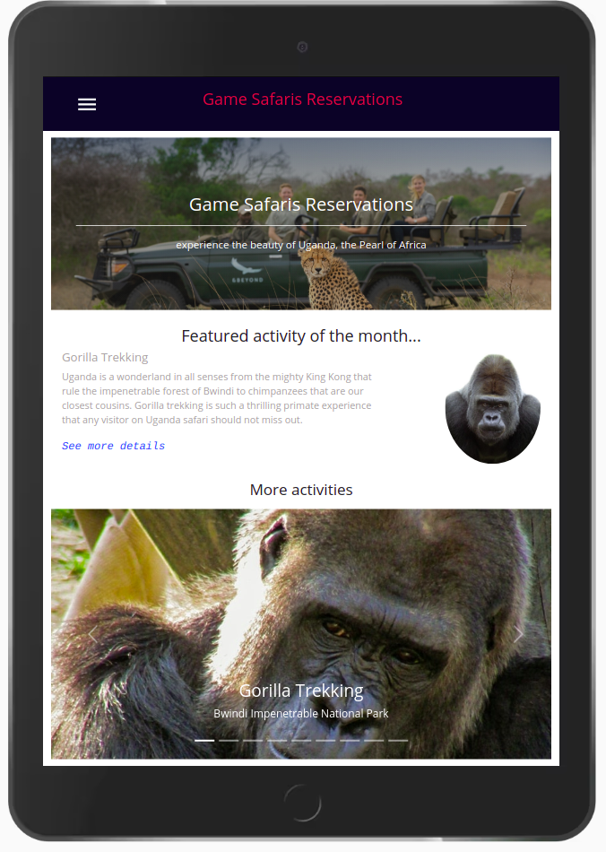
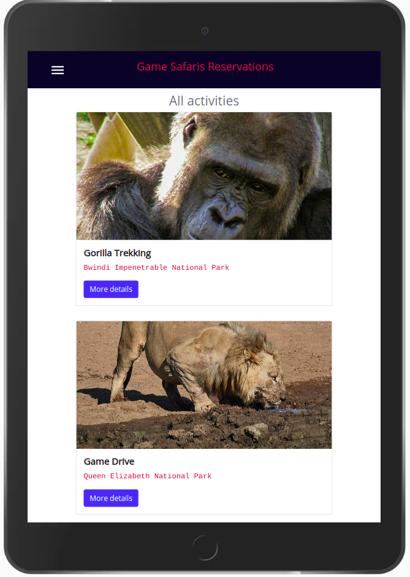
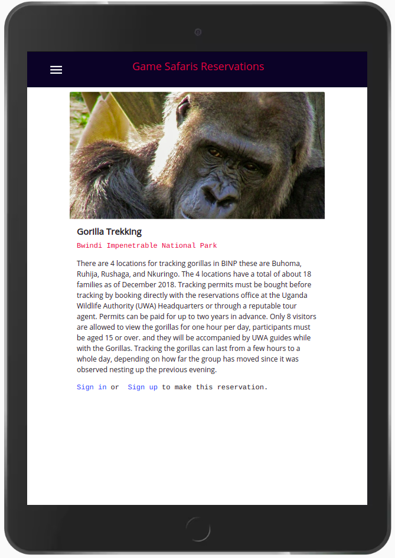

# GAME SAFARIS RESERVATIONS

## About

Game Safaris Reservations is a mobile(tablet version), single page application built with React, Redux, and consuming data from [Game Safaris Reservation API](https://galisoft-gamesafaris-back-end.herokuapp.com) built using Ruby on Rails. The application uses Redux store, a popular state management library, to manage the data used by the application. The application allows the site visitor to browse through a list of available Game Safaris activities, create an account and make a reservation.

## Built With

- HTML
- CSS
- Webpack
- npm
- React.js
- Redux
- game-park-reservations-api

## Screen shots

### Home page



### Sign in page


### Activities page



### Activity details page



## Live Demo

[Live Demo Link](https://galisoft-gamesafaris.netlify.app)

## prerequisite

You must have a live internet connection before you get started.

## Getting started

To get started:

### Clone the repo:

```
$ git clone https://github.com/gango-anan/game-park-reservations-front.git
```

## Setup and run the application

### Install node.js:

```
First install node.js
```

### Next, navigate to the project folder and install other dependencies using the following command:

```
$ npm install
```

### Run the test suite to verify that everything is working correctly:

```
$ npm test
```

### If the test suite passes, launch the web server using the following command:

```
$ npm start
```

### Finally you can launch the application in your browser URL tab, by typing:

```
localhost:3001
```

## Author

Galiwango Ananiya

- GitHub: [@gango-anan](https://github.com/gango-anan)
- Twitter: [@gango_anan](https://twitter.com/gango_anan)
- LinkedIn: [@galiwango-ananiya](https://www.linkedin.com/in/galiwango-ananiya/)

## 🤝 Contributing

Contributions, issues, and feature requests are welcome!

Feel free to check the [issues page](https://github.com/gango-anan/game-park-reservations-front/issues).

## Show your support

Give a ⭐️ if you like this project!

## Acknowledgments

- [Microverse Inc](https://www.microverse.org/)
- Original design idea by [ Murat Korkmaz on Behance](https://www.behance.net/muratk)

## 📝 License

This project is [MIT](https://github.com/gango-anan/game-park-reservations-front/blob/front-end-features/LICENSE) licensed.

[](https://app.netlify.com/sites/galisoft-gamesafaris/deploys)
